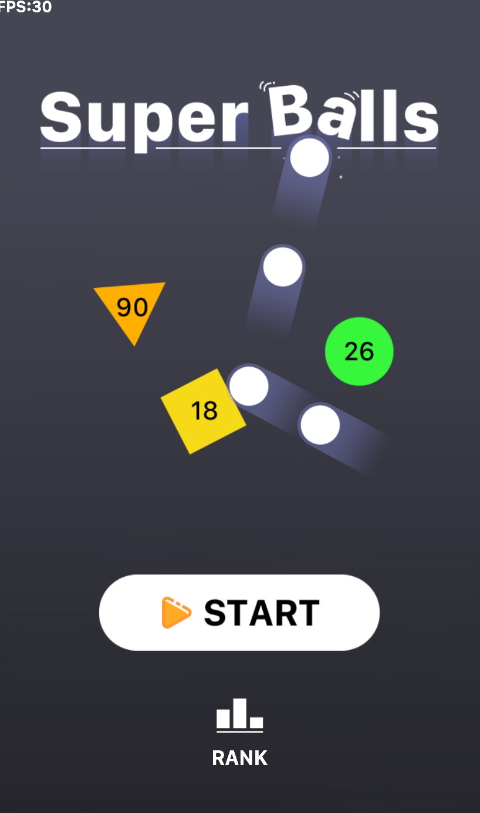
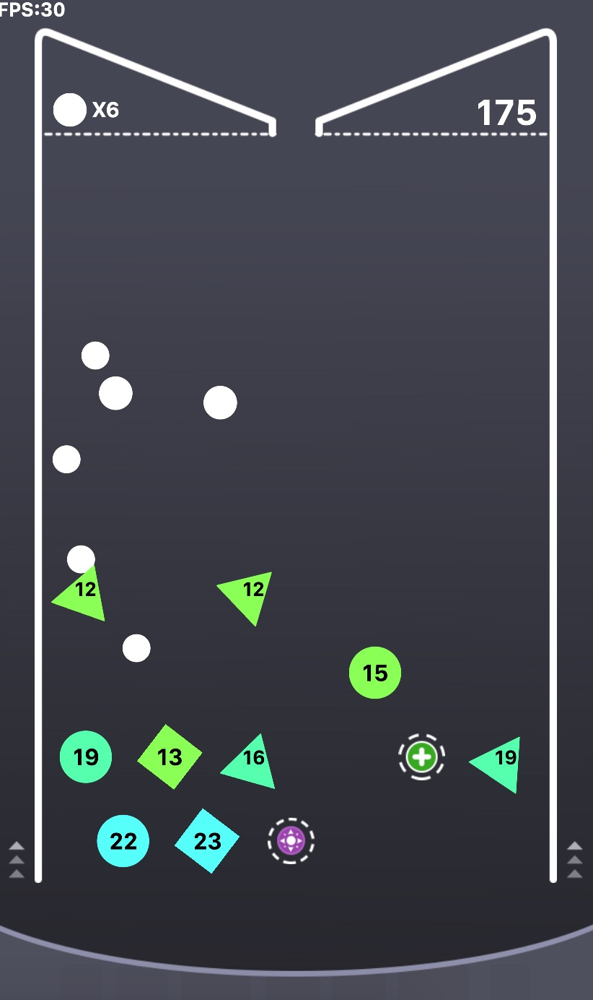

# Use p2.js in Egret Game

## Summary
[p2.js](https://github.com/schteppe/p2.js) 是Egret官方推荐的物理引擎，相对
box2d引擎更轻量并且效率也更高，适合于H5游戏开发的使用。（个人原因是不喜欢box2d，莫名的）
开发的游戏是"物理弹球"的小游戏，因为之前并没有在Egret上使用物理引擎，所以算是试了趟水，
踩了一些坑吧，毕竟p2的国内文档并不是很多，但是其实看官方[API和文档](http://schteppe.github.io/p2.js/docs/)
就已经足够了，加之Egret本身也有关于p2的使用[Demo](https://github.com/egret-labs/egret-game-library/tree/master/physics)，
所以使用起来还算顺利，就简单记录下心得吧。
## 创建世界
使用物理引擎当然需要物理世界啦，所以第一步就是先创建一个合适的物理世界。
```TypeScript
    public createWorld() {
        let wrd: p2.World = new p2.World();
        this.world = wrd;

        wrd.sleepMode = p2.World.BODY_SLEEPING;
        wrd.gravity = [0, 2000];
        wrd.applyGravity = false;
        this.world.setGlobalStiffness(1e20);
        this.world.defaultContactMaterial.restitution = .1;

        this.world.addContactMaterial(new p2.ContactMaterial(NodeHelper.Material_Ball, NodeHelper.Material_Ball, {
            restitution: 0,
            friction: 1
        }));
        ...
    }
```
首先，创建了一个世界，然后设置世界内物体的睡眠模式，之后设置了重力，这里值得注意的是，
在p2引擎里，向量和坐标所使用的都是数组，即`[x, y]`模式。在之后，设置了是否自动使用重力，
这里设置为`false`，因为在本游戏中需要自行进行重力加速的的累加计算，而不是由引擎自己进行。
这种设置其实在物理游戏内很常见，因为总有各种特殊的需求，当由自己控制的时候会方便很多。
再然后，就是设置一些属性了，比如设置了全局的物体硬度，这只适用于默认材质的物体，自然是
数值越大就硬度越高了。之后设置了默认碰撞材质的弹性力度，值从0到1，越大弹性越好，1的时候
就是以相同速度反弹回去了。之后添加了一些游戏中用到的碰撞材质，同时设置了弹性和摩擦属性，
在物理游戏中这些属性很重要，非常影响游戏体验，所以必须得要反复调试，适应需求来调整，这里
就不赘述了。
## 设置调试显示
首先，p2本身是没有支持显示功能的，也就是说，你创建出来的任何物体和形状都是看不到的，只有
引擎自身在进行计算，虽然如此，p2的`body`也有个一个`.displays`属性，它是一个数组，可以
用来存储所有你想与这个`body`绑定的显示对象，然后在进行显示位置的轮询更新，这样就达到了
显示的目的，虽说有点麻烦，但是还是很灵活的。
这里我就不贴代码了，每个游戏的需求是不同的，但是有个用于显示Debug调试的工具可以在项目前期
使用，[p2DebugDraw](https://github.com/egret-labs/egret-game-library/blob/master/physics/demo2/src/p2DebugDraw.ts)
使用方法如下：
```TypeScript
    private createDebug(): void {
        if(this.debugDraw) return;
        //创建调试试图
        this.debugDraw = new p2DebugDraw(world);
        let sprite: egret.Sprite = new egret.Sprite();
        this.addChild(sprite);
        this.debugDraw.setSprite(sprite);
    }
```
## 创建物体
首先创建`body`即刚体
```TypeScript
    public createBody(x:number, y:number, mass:number, angle:number = 0):p2.Body {
        let body = new p2.Body({
            mass,
            position:[x, y],
            type:p2.Body.DYNAMIC,
            angle,
            gravityScale: 1,
        });
        return body;
    }
```
参数就不多解释了，API都有，主要说几个问题吧。`type`有`DYNAMIC`和`STATIC`之分，如字面
意思。`angle`是弧度不是角度。`gravityScale`设置为0则无视重力，1为满重力，-1为反重力。
还有，如果在构造之后对`mass`进行赋值或者更改的话，需要再调用`updateMassProperties()`
才能生效。
然后创建形状
```TypeScript
    createBox(width:number, height:number, angle:number, group:number, mask:number):p2.Box {
        let shape = new p2.Box({
            width,
            height,
            angle,
            collisionGroup: group,
            collisionMask: mask,
        });
        shape.material = NodeHelper.Material_Target;
        return shape;
    }
```
`width`，`height`，`angle`是基本属性，没什么可说的，`collisionGroup`是该物体所属的
碰撞检测组，`collisionMask`是该物体期望碰到的物体组进行 `|` 运算之后的数值，例如
```
    shape.collisionGroup = CollisionGroup.Target;
    shape.collisionMask = CollisionGroup.Ball | CollisionGroup.GameOver;
```
所以碰撞组的值应该是`pow(2, x)`。
`material`是物体的材质，材质这个类只有一个属性，即`id`用来区分，在世界添加碰撞材质的时候
`addContactMaterial(mat1:p2.Material, mat2:p2.Material)`用的到。
之后要进行添加
```
    body.addShape(shape);
    world.addBody(body);
```
这样，就在世界中添加了一个物体了。
## 动起来
加了之后要怎么样驱动呢？进行轮询。
```
    world.step(0.016);
```
轮询的参数应该是固定值，而且轮询的间隔也应该是固定的，即`fixed`。
##
> 好了，至此基本流程就走完了。说一下项目过程中遇到的一些问题吧
> + 会出现物理引擎的常见问题，就是重叠的问题，两个物体相碰撞的时候会在两帧之间与另一个物体
相交，这在很多时候都是不愿意看到的，所以在不修改引擎的基础上，就要进行射线检测了，这就留作优化部分吧。
> + 物理游戏和别的游戏有很大差别，所有的参数设置都要经过细细推敲，不能靠感觉，当然，经验
也就很重要了，所以，对不懂的事情多动动脑子，别老是想当然。

最后，补上两张游戏成品截图。


